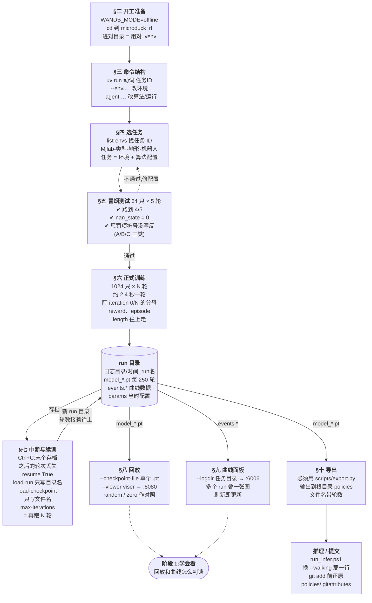

# 阶段 0 结构图:会用命令

复习用:一张图回忆阶段 0 的知识结构。图里的「§五」指课程 [`stage0_commands.md`](stage0_commands.md) 第五节,细节回那里查。

在 VS Code 里看:先装预览插件 Markdown Preview Mermaid Support(扩展 ID `bierner.markdown-mermaid`),打开本文件后按 Ctrl+Shift+V 预览。

主线是从上到下的一条流水线；虚线是「回头」或者「通往下一阶段」。【这条流水线换机器人也一样：选任务 → 冒烟 → 训练 → 存档 → 回放 / 曲线 / 导出。图里的命令和数字是 microduck 特有的】
