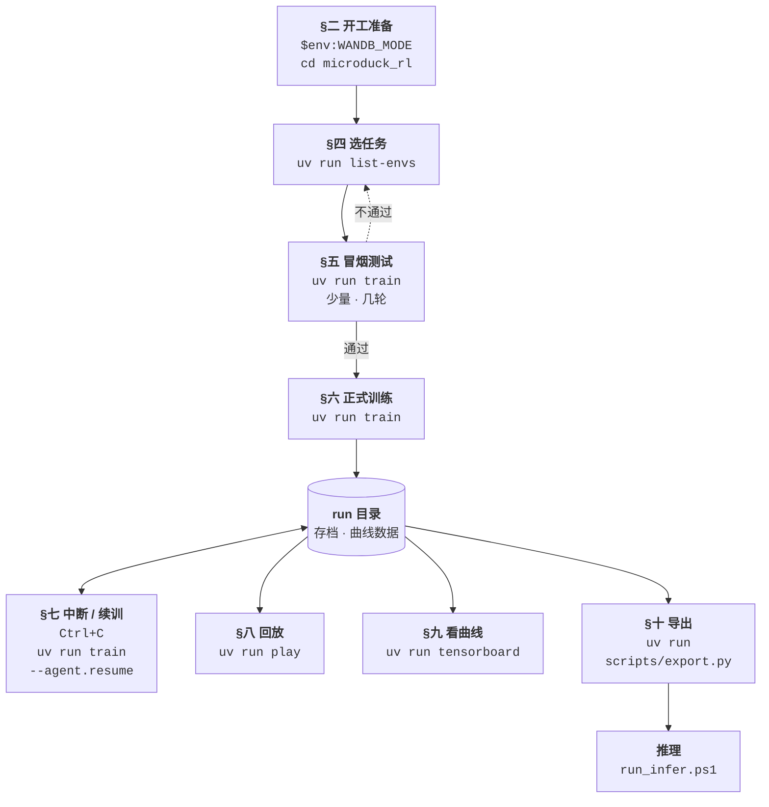

# 阶段 0:会用命令

```mermaid
flowchart TB
  prep["<b>§二 开工准备</b><br/><code>$env:WANDB_MODE</code><br/><code>cd microduck_rl</code>"]
  task["<b>§四 选任务</b><br/><code>uv run list-envs</code>"]
  smoke["<b>§五 冒烟测试</b><br/><code>uv run train</code><br/>少量 · 几轮"]
  train["<b>§六 正式训练</b><br/><code>uv run train</code>"]
  run[("<b>run 目录</b><br/>存档 · 曲线数据")]
  resume["<b>§七 中断 / 续训</b><br/><code>Ctrl+C</code><br/><code>uv run train</code><br/><code>--agent.resume</code>"]
  play["<b>§八 回放</b><br/><code>uv run play</code>"]
  tb["<b>§九 看曲线</b><br/><code>uv run tensorboard</code>"]
  export["<b>§十 导出</b><br/><code>uv run</code><br/><code>scripts/export.py</code>"]
  infer["<b>推理</b><br/><code>run_infer.ps1</code>"]

  prep --> task --> smoke -- 通过 --> train --> run
  smoke -. 不通过 .-> task
  run <--> resume
  run --> play
  run --> tb
  run --> export --> infer
```
