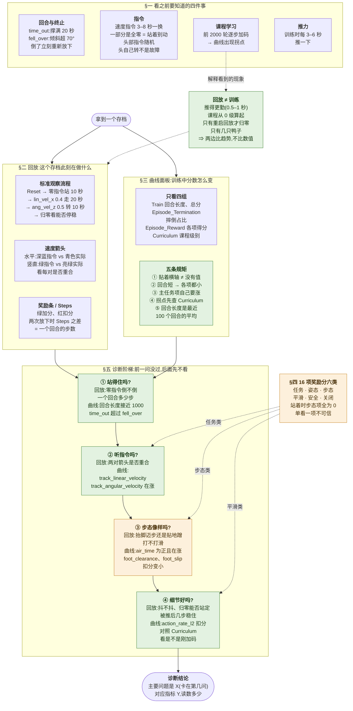

# 阶段 1 结构图:学会看

复习用:一张图回忆阶段 1 的知识结构。图里的「§五」指课程 [`stage1_observe.md`](stage1_observe.md) 第五节,细节回那里查。

读法：拿到存档后，回放和曲线面板两边一起看（§二、§三），证据都汇到诊断阶梯（§五），从第 ① 问开始逐问往下，卡住的那一问就是结论。§一 的四件事和「回放 ≠ 训练」用来解释看到的现象；§四 的奖励分类告诉你每一问该看哪几项。

颜色：**绿色**是【换机器人也一样】的判读方法；**橙色**是【microduck 特有】的内容（具体奖励项、腿足步态）；紫色是工具和背景知识。
