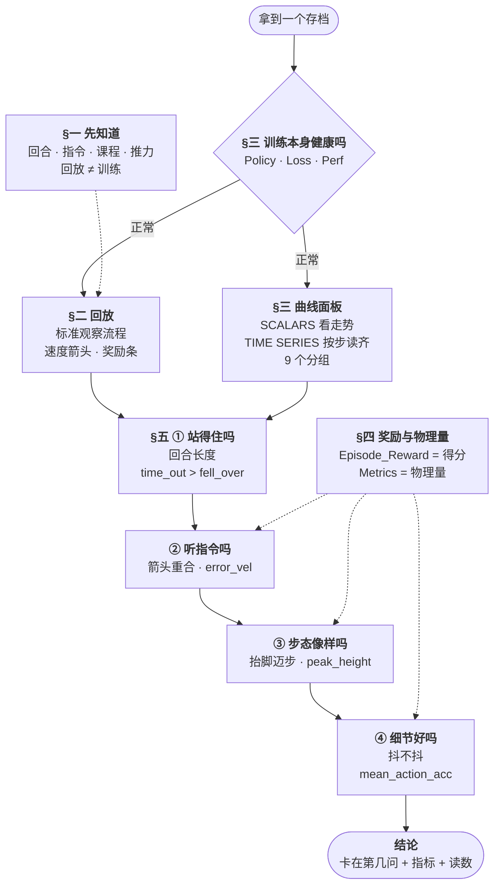

# 阶段 1:学会看

```mermaid
flowchart TB
  ck(["拿到一个存档"])
  bg["<b>§一 先知道</b><br/>回合 · 指令 · 课程 · 推力<br/>回放 ≠ 训练"]
  health{"<b>§三 训练本身健康吗</b><br/>Policy · Loss · Perf"}
  play["<b>§二 回放</b><br/>标准观察流程<br/>速度箭头 · 奖励条"]
  curve["<b>§三 曲线面板</b><br/>SCALARS 看走势<br/>TIME SERIES 按步读齐<br/>9 个分组"]
  rew["<b>§四 奖励与物理量</b><br/>Episode_Reward = 得分<br/>Metrics = 物理量"]
  q1["<b>§五 ① 站得住吗</b><br/>回合长度<br/>time_out > fell_over"]
  q2["<b>② 听指令吗</b><br/>箭头重合 · error_vel"]
  q3["<b>③ 步态像样吗</b><br/>抬脚迈步 · peak_height"]
  q4["<b>④ 细节好吗</b><br/>抖不抖<br/>mean_action_acc"]
  out(["<b>结论</b><br/>卡在第几问 + 指标 + 读数"])

  ck --> health
  health -- 正常 --> play
  health -- 正常 --> curve
  bg -.-> play
  play --> q1
  curve --> q1
  q1 --> q2 --> q3 --> q4 --> out
  rew -.-> q2
  rew -.-> q3
  rew -.-> q4
```
